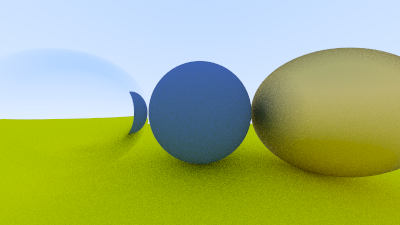

# raytracing in not exactly one weekend

https://raytracing.github.io/books/RayTracingInOneWeekend.html

## current progress



## run

use clojure

```
clojure -M:main
```


## note

- still doesn't understand parallelism here, the faster is when I give it size 2 threadpool, why?


## raytracing2 + vec3i

vec3i = vector operation that lives on a single preallocated contiguous primitive array

I dont know if this is a good idea, gonna try and test my understanding