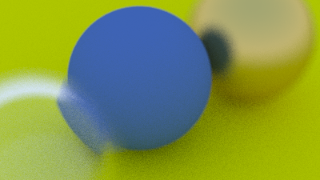

# raytracing in not exactly one weekend

https://raytracing.github.io/books/RayTracingInOneWeekend.html

## current progress



## run

either use [babashka](https://book.babashka.org/#getting_started)

```
bb -m raytracing
```

or clojure

```
clojure -M:main
```
